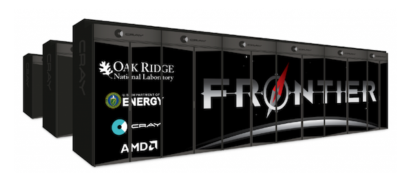
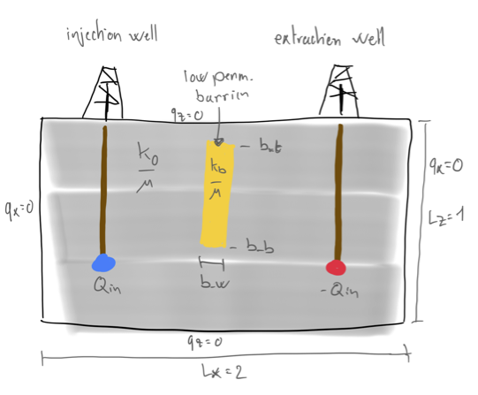
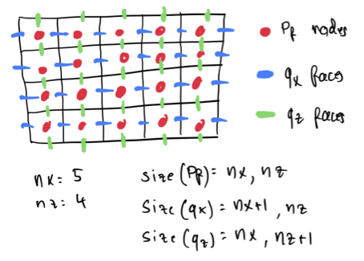
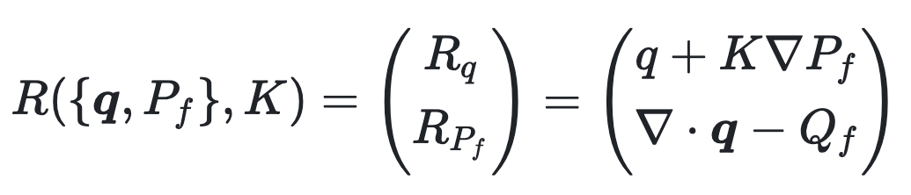
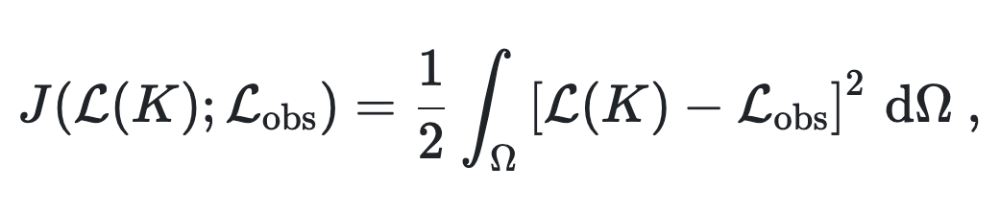
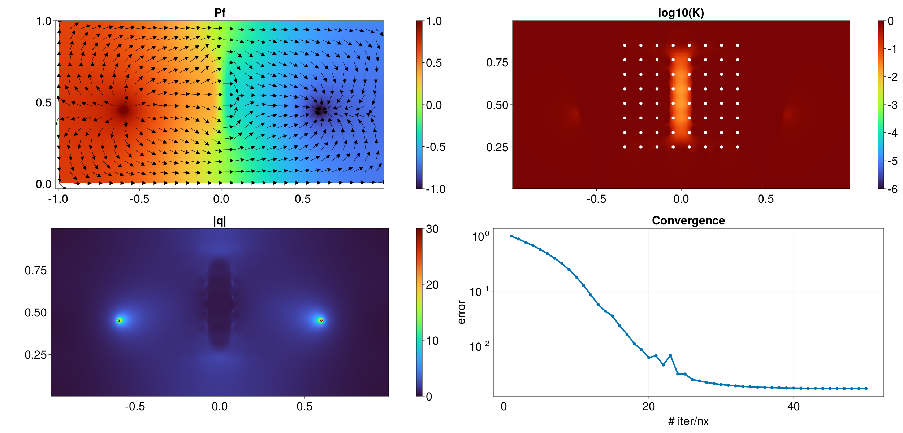

# Differentiable modelling on (multi)-GPUs

[**JuliaCon 2023 workshop | Tue, July 25, 9:00-12:00 ET (15:00-17:00 CEST)**](https://pretalx.com/juliacon2023/talk/GTKJZL/)

[**:eyes: watch the workshop recording**](https://www.youtube.com/watch?v=6qviCIwvEng)

> :warning: Make sure to `git pull` this repo right before starting the workshop in order to ensure you have access to the latest updates

## Program
- [Getting started](#getting-started)
- [Brief **intro to Julia for HPC** :book:](#julia-for-hpc)
  - Performance, CPUs, GPUs, array and kernel programming
- [Presentation of **the challenge of today** :book:](#the-challenge-of-today)
  - Optimising injection/extraction from a heterogeneous reservoir
- [**Hands-on I** - solving the forward problem :computer:](#hands-on-i)
  - Steady-state diffusion problem
  - The accelerated pseudo-transient method
  - Backend agnostic kernel programming with math-close notation
- [Presentation of **the optimisation problem** :book:](#the-optimisation-problem)
  - Tha adjoint method
  - Julia and the automatic differentiation (AD) tooling
- [**Hands-on II** - HPC GPU-based inversions :computer:](#hands-on-ii)
  - The adjoint problem using AD
  - GPU-based adjoint solver using [Enzyme.jl](https://github.com/EnzymeAD/Enzyme.jl) from [ParallelStencil.jl](https://github.com/omlins/ParallelStencil.jl)
  - Gradient-based inversion using [Optim.jl](https://github.com/JuliaNLSolvers/Optim.jl)
- [Wrapping-up](#wrapping-up)
  - **Demo**: Multi-GPU inversion using AD and distributed memory parallelisation with [ImplicitGlobalGrid.jl](https://github.com/eth-cscs/ImplicitGlobalGrid.jl)
  - What we learned - **recap**

## The `SMALL` print
The goal of today's workshop is to develop a fast iterative GPU-based solver for elliptic equations and use it to:
1. Solve a steady state subsurface flow problem (geothermal operations, injection and extraction of fluids)
2. Invert for the subsurface permeability having a sparse array of fluid pressure observations
3. Verify that the approach works using a distributed memory parallelisation on multiple GPUs

We will not use any "black-box" tooling but rather try to develop concise and performant codes (300 lines of code, max) that execute on multiple GPUs. We will also use automatic differentiation (AD) capabilities and the differentiable Julia stack to automatise the calculation of the adjoint solutions in the gradient-based inversion procedure.

The main Julia packages we will rely on are:
- [ParallelStencil.jl](https://github.com/omlins/ParallelStencil.jl) for automatic optimization and architecture agnostic shared memory parallelisation
- [ImplicitGlobalGrid.jl](https://github.com/eth-cscs/ImplicitGlobalGrid.jl) for distributed memory parallelisation
- [Enzyme.jl](https://github.com/EnzymeAD/Enzyme.jl) for AD on GPUs
- [CairoMakie.jl](https://github.com/MakieOrg/Makie.jl) for visualisation
- [Optim.jl](https://github.com/JuliaNLSolvers/Optim.jl) to implement an optimised gradient-descent procedure

The workshop promotes "hands-on". Blanked-out scripts for most of the steps are available in the [scripts](scripts/) folder. Solutions scripts (following the `s_xxx.jl` pattern) will are available in the [scripts_solutions](scripts_solutions) folder.

:rocket: Note that we will not extensively investigate performance during this workshop because of time limitations. However, there will be **talk given by Sam Omlin focussing specifically on this topic: [Scalable 3-D PDE Solvers Tackling Hardware Limit](https://pretalx.com/juliacon2023/talk/BLCWQW/).**

#### :bulb: Useful extra resources
- The Julia language: [https://julialang.org](https://julialang.org)
- PDE on GPUs ETH Zurich course: [https://pde-on-gpu.vaw.ethz.ch](https://pde-on-gpu.vaw.ethz.ch)
- SCALES workshop: [https://github.com/PTsolvers/Julia-HPC-Scales](https://github.com/PTsolvers/Julia-HPC-Scales)

## Getting started
Before we start, let's make sure that everyone can run the presented codes on either their local or remote CPU, ideally GPU machine.

> ⚠️ We are using some exciting latest features from the Julia GPU and AD stack which requires to run on **Julia 1.9.2**, using:
```
Enzyme v0.11.6
ImplicitGlobalGrid v0.13.0
MPI v0.20.12
ParallelStencil v0.8.1
```
for a smooth experience.

The fast-track is to clone this repo
```
git clone https://github.com/PTsolvers/gpu-workshop-JuliaCon23.git
```

Once done, navigate to the cloned folder, launch Julia (we will demo the workshop using VSCode on a Nvidia A100) and activate the environment by typing
```julia-repl
] activate .
```
from within the REPL.
Then follow it up with
```julia-repl
] instantiate
```
to instantiate the project and its dependencies.

If all went fine, you should be able to execute the following command in your Julia REPL:
```julia-repl
julia> include("scripts/visu_2D.jl")
```

which will produce this figure:


## Julia for HPC
The Julia at scale effort:
- Julia is fast as lower level code
- Julia is interactive as higher-level code

[**Julia is cool** 🙂 exactly for that](https://pde-on-gpu.vaw.ethz.ch/lecture1/#julia_is_cool)

### The (yet invisible) cool stuff
Today, we will develop code that:
- Runs on multiple graphics cards using the Julia language
- Uses a fully local and iterative approach (scalability)
- Retrieves automatically the vector-Jacobian product (VJP) using automatic differentiation (AD)
- (All scripts feature about 300 lines of code)

Too good to be true? Hold on 🙂 ...

### Why to still bother with GPU computing in 2023
- It's around for more than a decade
- It shows massive performance gain compared to serial CPU computing
- First exascale supercomputer, Frontier, is full of GPUs


### Performance that matters


#### Hardware limitations
Taking a look at a recent GPU and CPU:
- Nvidia Tesla A100 GPU
- AMD EPYC "Rome" 7282 (16 cores) CPU

| Device         | TFLOP/s (FP64) | Memory BW TB/s | Imbalance (FP64)     |
| :------------: | :------------: | :------------: | :------------------: |
| Tesla A100     | 9.7            | 1.55           | 9.7 / 1.55  × 8 = 50 |
| AMD EPYC 7282  | 0.7            | 0.085          | 0.7 / 0.085 × 8 = 66 |

**Meaning:** we can do about 50 floating point operations per number accessed from main memory.
Floating point operations are "for free" when we work in memory-bounded regimes.

#### Numerical limitations
Moreover, the cost of evaluating a first derivative $∂A / ∂x$ using finite-differences:
```julia
q[ix] = -D * (A[ix+1] - A[ix]) / dx
```
consists of:
- 1 read (`A`) + 1 write (`q`) => $2 × 8$ = **16 Bytes transferred**
- 1 addition + 1 multiplication + 1 division => **3 floating point operations**

_assuming $D$, $∂x$ are scalars, $q$ and $A$ are arrays of `Float64` (read from main memory)_

:bulb: **Requires to re-think the numerical implementation and solution strategies**

### The advantage of GPUs
GPUs have a large memory bandwidth, which is **crucial** since we are memory bounded.

👉 Let's assess how close from memory copy (1355 GB/s) we can get solving a 2D diffusion problem:

$$ ∇⋅(D ∇ C) = \frac{∂C}{∂t} $$

on an Nvidia Tesla A100 GPU (using a simple [perftest.jl](scripts/perftest.jl) script).

### Why to still bother with GPU computing in 2023
Because it is still challenging:
- Very few codes use it efficiently.
- It requires to rethink the solving strategy as non-local operations will kill the fun.

## The challenge of today
The goal fo today is to solve a subsurface flow problem related to injection and extraction of fluid in the underground as it could occur in geothermal operations. For this purpose, we will solve an elliptic problem for fluid pressure diffusion, given impermeable boundary conditions (no flux) and two source terms, injection and extraction wells. In addition, we will place a low permeability barrier in-between the wells to simulate a more challenging flow configuration. The model configuration is depicted hereafter:



Despite looking simple, this problem presents several challenges to be solved efficiently. We will need to:
- efficiently solve an elliptic equation for the pressure
- handle source terms
- handle spatially variable material parameters

> :bulb: For practical purposes, we will work in 2D, however everything we will develop today is readily extensible to 3D.

The corresponding system of equation reads:

$$ q = -K~∇P_f ~, $$

$$ 0 = -∇⋅q + Q_f~, $$

where $q$ is the diffusive flux, $P_f$ the fluid pressure, $K$ is the spatially variable diffusion coefficient, and $Q_f$ the source term.

We will use an accelerated iterative solving strategy combined to a finite-difference discretisation on a regular Cartesian staggered grid:



The iterative approach relies in replacing the 0 in the mass balance equation by a pseudo-time derivative $∂/∂\tau$ and let it reach a steady state:

$$ \frac{∂P_f}{∂\tau} = -∇⋅q + Q_f~. $$

Introducing the residual $RP_f$, one can re-write the system of equations as:

$$ q = -K~∇P_f ~, $$

$$ RP_f = ∇⋅q -Q_f~, $$

$$ \frac{∂P_f}{∂\tau} = -RP_f~. $$

We will stop the iterations when the $\mathrm{L_{inf}}$ norm of $P_f$ drops below a defined tolerance `max(abs.(RPf)) < ϵtol`.

This rather naive iterative strategy can be accelerated using the accelerated pseudo-transient method [(Räss et al., 2022)](https://doi.org/10.5194/gmd-15-5757-2022). In a nutshell, pseudo-time derivative can also be added to the fluxes turning the system of equations into a damped wave equation. The resulting augmented system of accelerated equations reads:

$$ Rq = q +K~∇P_f ~, $$

$$ \frac{∂q}{∂\tau_q} = -Rq~, $$

$$ RP_f = ∇⋅q -Q_f~, $$

$$ \frac{∂P_f}{∂\tau_p} = -RP_f~. $$

Finding the optimal damping parameter entering the definition of $∂\tau_q$ and $∂\tau_p$ further leads to significant acceleration in the solution procedure.

## Hands-on I
Let's get started. In this first hands-on, we will work towards making an efficient iterative GPU solver for the forward steady state flow problem.

### ✏️ Task 1: Steady-state diffusion problem
The first script we will look at is [geothermal_2D_noacc.jl](scripts/geothermal_2D_noacc.jl). This script builds upon the [visu_2D.jl](scripts/visu_2D.jl) scripts and contains the basic ingredients to iteratively solve the elliptic problem for fluid pressure diffusion with spatially variable permeability.

👉 Let's run the [geothermal_2D_noacc.jl](scripts/geothermal_2D_noacc.jl) script and briefly check how the iteration count normalised by `nx` scales when changing the grid resolution.

### ✏️ Task 2: The accelerated pseudo-transient method
As you can see, the overall iteration count is really large and actually scales quadratically with increasing grid resolution.

To address this issue, we can implement the accelerated pseudo-transient method [(Räss et al., 2022)](https://doi.org/10.5194/gmd-15-5757-2022). Practically, we will define residuals for both x and y fluxes (`Rqx`, `Rqy`) and provide an update rule based on some optimal numerical parameters consistent with the derivations in [(Räss et al., 2022)](https://doi.org/10.5194/gmd-15-5757-2022).

This acceleration implemented in the [geothermal_2D.jl](scripts/geothermal_2D.jl) script, we now (besides other changes):
- reduced the cfl from `clf = 1 / 4.1` to `cfl = 1 / 2.1`
- changed `dτ = cfl * min(dx, dy)^2` to `vdτ = cfl * min(dx, dy)`
- introduced a numerical Reynolds number (`re = 0.8π`)

👉 Let's run the [geothermal_2D.jl](scripts/geothermal_2D.jl) script and check how the iteration count scales as function of grid resolution.

> :bulb: Have a look at [SCALES workshop](https://github.com/PTsolvers/Julia-HPC-Scales) repo if you are interested in working out the intermediate steps.

### ✏️ Task 3: Backend agnostic kernel programming with math-close notation
Now that we have settled the algorithm, we want to implement it in a backend-agnostic fashion in order to overcome the two-language barrier, having a **unique script** to allow for rapid prototyping and efficient production use. This script should ideally target CPU and various GPU architectures and allow for "math-close" notation of the physics. For this purpose, we will use [ParallelStencil](https://github.com/omlins/ParallelStencil.jl). 

👉 Let's open the [geothermal_2D_ps.jl](scripts/geothermal_2D_ps.jl) script and add the missing pieces following the steps.

First, we need to use ParallelStencil and the finite-difference helper module:
```julia
using ParallelStencil
using ParallelStencil.FiniteDifferences2D
```

Then, we can initialise ParallelStencil choosing the backend (`Threads`, `CUDA`, `AMDGPU`), the precision (`Float32`, `Float64`, or others, complex) and the number of spatial dimensions (`1`, `2`, or `3`). For Nvidia GPUs in double precision and 2D it will be
```julia
@init_parallel_stencil(CUDA, Float64, 2)
```

Then, we will move the physics computations into functions and split them into 4 functions:
```julia
@parallel function residual_fluxes!(Rqx, Rqy, ???)
    @inn_x(Rqx) = ???
    @inn_y(Rqy) = ???
    return
end

@parallel function residual_pressure!(RPf, ???)
    @all(RPf) = ???
    return
end

@parallel function update_fluxes!(qx, qy, ???)
    @inn_x(qx) = ???
    @inn_y(qy) = ???
    return
end

@parallel function update_pressure!(Pf, ???)
    @all(Pf) = ???
    return
end
```
Use the helper macros from the `ParallelStencil.FiniteDifferences2D` module to implement averaging, differentiating and inner point selection. Type:
```julia-repl
julia> ?

help?> FiniteDifferences2D
```
for more information on the available macros.

Next, we can change the initialisation of arrays from e.g. `zeros(Float64, nx, ny)` to `@zeros(nx, ny)`. Also, note that to "upload" an array `A` to the defined backend you can use `Data.Array(A)` and to "gather" it back as CPU array `Array(A)`.

Then we have to call the compute functions from within the iteration loop using the `@parallel` keyword:
```julia
@parallel residual_fluxes!(Rqx, Rqy, ???)
@parallel update_fluxes!(qx, qy, ???)
@parallel residual_pressure!(RPf, ???)
@parallel update_pressure!(Pf, ???)
```

As last step, we have to make sure to "gather" arrays for visualisation back to CPU arrays using `Array()`.

👉 Run the [geothermal_2D_ps.jl](scripts/geothermal_2D_ps.jl) script and check execution speed on CPU and GPU (if available). Have a look at the [s_geothermal_2D_ps.jl](scripts_solutions/s_geothermal_2D_ps.jl) script if you are blocked or need hints.

> :bulb: Have a look at [SCALES workshop repo](https://github.com/PTsolvers/Julia-HPC-Scales) if you are interested in the intermediate steps going from array to kernel programming on both CPU and GPU.

## The optimisation problem
In the first part of this workshop, we have learned how to compute the fluid pressure and fluxes in the computational domain with a given permeability distribution. In many practical applications the properties of the subsurface, such as the permeability, are unknown or poorly constrained, and the direct measurements are very sparse as they would require extracting the rock samples and performing laboratory experiments. In many cases, the _outputs_ of the simulation, i.e. the pressure and the fluxes, can be measured in the field at much higher spatial and temporal resolution. Therefore, it is useful to be able to determine such a distribution of the properties of the subsurface, that the modelled pressures and fluxes match the observations as close as possible. The task of finding this distribution is referred to as _the inverse modelling_. In this session, we will design and implement the inverse model for determining the permeability field, using the features of Julia, such as GPU programming, automatic differentiation, and numerical optimization packages.

### Introduction
In the following, we will refer to the model that maps the permeability to the pressure and the fluxes as _the forward model_. Opposed to the _forward model_, the inputs of the _inverse model_ are the _observed_ values of the pressure and the fluxes, and the outputs are the distributions of the subsurface properties. The results of the inverse modelling can be then used to run a forward model to check if the modelled quantities indeed match the observed ones.

Let's define the results of the forward model as the mapping $\mathcal{L}$ between the subsurface permeability field $K$ and the two fields: the pressure $P$ and the flux $\boldsymbol{q}$. To describe this mapping, we use the fact that the solution to the system of the governing equations for the pressure makes the residual $R$ to be equal to zero:

$$\mathcal{L}: K \rightarrow \{\boldsymbol{q}, P_f\}\quad | \quad R(\{\boldsymbol{q}, P_f\}, K) = 0.$$

The residual of the problem is a vector containing the left-hand side of the system of governing equations, written in a such a form in which the right-hand side is $0$:

<p align="center">
  
</p>

To quantify the discrepancy between the results of the forward model $\mathcal{L}$ and the observations $\mathcal{L}_\mathrm{obs}$, we introduce the _objective function_ $J$, which in the simplest case can be defined as:

<p align="center">
  
</p>

where $\Omega$ is the computational domain.

The goal of the inverse modelling is to find such a distribution of the parameter $K$ which minimises the objective function $J$:

<p align="center">
  
</p>

Therefore, the inverse modelling is tightly linked to the field of mathematical optimization. Numerous methods of finding the optimal value of $K$ exist, but in this workshop we will focus on _gradient-based_ methods. One of the simplest gradient-based method is the method of [**the gradient descent**](https://en.wikipedia.org/wiki/Gradient_descent), but there are many other powerful gradient-based methods such as quasi-Newton [**L-BFGS**](https://en.wikipedia.org/wiki/Limited-memory_BFGS) method.

The gradient of the objective function with respect to the permeability $\mathrm{d}J/\mathrm{d}K$ is tricky to compute, since the objective function $J$ depends on the solution $\mathcal{L}$, which is given implicitly as the solution to the system of PDEs. To compute the gradient, we will use the _adjoint state method_. 

### Adjoint state method
Adjoint state method allows to compute the point-wise gradient of the scalar-valued objective function in an efficient manner by solving the _adjoint equation_, which is a linear system of equations having the same structure and the forward system.

> :bulb: To save time, we have implemented the adjoint solver for you, but if you're interested in the detailed derivation of the adjoint equations, you can read them below.

<details>
<summary><h3>Derivation</h3></summary>

The objective function $J$ is a function of the solution $\mathcal{L}$, which depends on the parameter $K$ (in our case $K$ is the permeability). We can use the chain rule of differentiation to express the gradient:

<table>
  <td><p align="center">
    
  </p></td>
  <td>(1)</td>
</table>

In this expression, some of the terms are easy to compute. If the cost function is defined as a square of the difference between the modelled solution and observed values (see above), then $\partial J / \partial\mathcal{L} = \mathcal{L} - \mathcal{L}_\mathrm{obs}$, and $\partial J / \partial K = 0$. The tricky term is the derivative $\mathrm{d}\mathcal{L}/\mathrm{d}K$ of the solution w.r.t. the permeability. 

> :warning: In this section we use the standard notation for partial and total derivatives. This is correct for the finite-dimensional analysis, i.e. for discretised versions of the equations. However, in the continuous case, the derivatives are the functional derivatives, and a more correct term for the objective function would be the "objective functional" since it acts on functions. In the workshop, we'll only work with the discretised form of equations, so we use the familiar notation to keep the explanation simple.

Note that the solution $\mathcal{L}$ is a vector containing the fluxes $\boldsymbol{q}$ and the pressure $P_f$:

<table>
<td><p align="center">
  
</p></td>
<td>(2)</td>
</table>

To compute this tricky term, we note that the solution to the forward problem nullifies the residual $R$. Since both $R_q=0$ and $R_{P_f}=0$ for any solution $\{\boldsymbol{q}, P_f\}$, the total derivative of $R_q$ and $R_{P_f}$ w.r.t. $K$ should be also $0$:

<p align="center">
  
</p>

This is the system of equations which could be solved for $\mathrm{d}\boldsymbol{q}/\mathrm{d}K$ and $\mathrm{d}P_f/\mathrm{d}K$. It useful to recast this system into a matrix form. Defining $R_{f,g} = \partial R_f/\partial g$ we obtain:

<p align="center">
  
</p>

One could solve this system of equations to compute the derivatives. However, the sizes of the unknowns $\mathrm{d}\boldsymbol{q}/\mathrm{d}K$ and $\mathrm{d}P_f/\mathrm{d}K$ are $N_{\boldsymbol{q}}\times N_K$ and $N_{P_f}\times N_K$, respectively. Recalling that in 2D number of grid points is $N = n_x\times n_y$, we can estimate that $N_{\boldsymbol{q}} = 2N$ since the vector field has 2 components in 2D, and $N_K = N$. Solving this system would be equivalent to the direct perturbation method, and is prohibitively expensive.

Luckily, we are only interested in evaluating the objective function gradient (1), which has the size of $1\times N_K$. This could be achieved by introducing extra variables $\Psi_{\boldsymbol{q}}$ and $\Psi_{P_f}$, called the _adjoint variables_. These adjoint variables satisfy the following _adjoint equation_:

<table>
<td><p align="center">
  
</p></td>
<td>(3)</td>
</table>

The sizes of the unknowns $\Psi_{\boldsymbol{q}}$ and $\Psi_{P_f}$ are $N_{\boldsymbol{q}}\times 1$ and $N_{P_f}\times 1$, respectively. Therefore, solving the adjoint equation involves only one linear solve! The "tricky term" in the objective function gradient could be then easily computed. This is most evident if we recast the equation (2) into the matrix form:

<p align="center">
  
</p>

Phew, there is a lot to process :sweat_smile:! We now established a very efficient way of computing point-wise gradients of the objective function. Now, we only need to figure out how to solve the adjoint equation (3).

### Pseudo-transient adjoint solver
In the same way that we solve the steady-state forward problem by integrating the equations given by residual $R$ in pseudo-time, we can augment the system (3) with the pseudo-time derivatives of the adjoint variables $\Psi_{\boldsymbol{q}}$ and $\Psi_{P_f}$:

<p align="center">
  
</p>

With this approach, we never need to explicitly store the matrix of the adjoint problem. Instead, we only need to evaluate the product of this matrix and the adjoint variables at the current iteration in pseudo-time. It is very similar to just computing the residuals of the current forward solution.

> :book: Note that the matrix in the adjoint equation is actually the transposed Jacobian matrix of the forward problem. Evaluating the product of the Jacobian matrix and a vector is a very common operation in computing, and this product is commonly abbreviated as JVP (_Jacobian-vector product_). Computing the product of the transposed Jacobian matrix and a column vector is equivalent to the product of the row vector and the same Jacobian. Therefore, it is termed VJP (_vector-Jacobian product_).

To solve the adjoint problem, we need to evaluate the VJPs given the residuals for the forward problem. It is possible to do that either analytically, which involves manual derivation for the transposed Jacobian for every particular system of equations, or numerically in an automated way, using the _automatic differentiation_.

</details>

The output of the adjoint solver is the adjoint pressure $\Psi_{P_f}$ and fluxes $\Psi_{\boldsymbol{q}}$. The gradient of the objective function could be computed as:

$$
\frac{\mathrm{d}J}{\mathrm{d}K} = - \Psi_{\boldsymbol{q}}^\mathrm{T}\dfrac{\partial R_{\boldsymbol{q}}}{\partial K} - \Psi_{P_f}^\mathrm{T}\dfrac{\partial R_{P_f}}{\partial K} + \frac{\partial J}{\partial K} = - \Psi_{\boldsymbol{q}}^\mathrm{T}\dfrac{\partial R_{\boldsymbol{q}}}{\partial K}~.
$$

To compute the product of the adjoint solution and the matrix of partial derivatives, we will use _automatic differentiation_.

### Automatic differentiation
[Automatic differentiation](https://en.wikipedia.org/wiki/Automatic_differentiation) (AD) allows evaluating the gradients of functions specified by code. Using AD, the partial derivatives are evaluated by repeatedly applying the chain rule of differentiation to the sequence of elementary arithmetic operations constituting a computer program.

> :bulb: Many constructs in computer programs aren't differentiable, for example, I/O calls or system calls. AD tools must handle such cases.

Automatic differentiation is a key ingredient of [_differentiable programming_](https://en.wikipedia.org/wiki/Differentiable_programming), a programming paradigm enabling gradient-based optimisation of the parameters of an arbitrary computer program.

### AD tools in Julia
Julia has a rich support for differential programming. With the power of tools like [Enzyme.jl](https://enzyme.mit.edu/julia/stable/) it is possible to automatically compute the derivatives of arbitrary Julia code, including the code targeting GPUs. 

### VJP calculations
One of the main building blocks in many optimization algorithms involves computing the Jacobian-vector product (VJP). AD tools simplify evaluating VJPs by generating the code automatically given the target function.

Let's familiarise with [Enzyme.jl](https://enzyme.mit.edu/julia/stable/), the Julia package for performing AD.

> :bulb: There are many other Julia packages for performing AD, e.g., [Zygote.jl](https://fluxml.ai/Zygote.jl/stable/). In this tutorial, we use Enzyme as it supports some features currently missing in other packages, e.g., differentiating mutating functions and GPU kernels.

Let's start with a simple example:
```julia-repl
julia> using Enzyme

julia> f(ω,x) = sin(ω*x)
f (generic function with 1 method)

julia> ∇f(ω,x) = Enzyme.autodiff(Reverse,f,Active,Const(ω),Active(x))[1][2]
∇f (generic function with 1 method)

julia> @assert ∇f(π,1.0) ≈ π*cos(π)
```

In this line: `∇f(x) = Enzyme.autodiff(Reverse,f,Active,Active(x))[1][1]`, we call `Enzyme.autodiff` function, which computes the partial derivatives. We pass `Reverse` as a first argument, which means that we use the reverse mode of accumulation (see below). We mark the arguments as either `Const` or `Active` to specify which partial derivatives are computed.

It is possible to use Enzyme.jl directly for more complicated tasks, such as computing the partial derivatives of vector-valued functions. But we will use the recently added feature of ParallelStencil, which allows to greatly simplify the gradient computations.

Let's extend the example with sine computation to the mutating vector-valued kernel:

```julia-repl
julia> using ParallelStencil, ParallelStencil.FiniteDifferences2D

julia> @init_parallel_stencil(Threads, Float64, 2)

julia> @parallel compute_sin!(r, ω, x) = (@all(r) = sin(ω*@all(x)); nothing)
...

julia> r = zeros(2, 2); r̄ = ones(2, 2)
...

julia> x = rand(2, 2); x̄ = zeros(2, 2)
...

julia> @parallel ∇=(r->r̄, x->x̄) compute_sin!(r, float(π), x)

julia> x̄ ≈ π.*cos.(π.*x)
true
```

This syntax allows computing vector-Jacobian products (VJPs):
```julia
@parallel ∇=(r->r̄, x->x̄) compute_sin!(r, float(π), x)
```

In this case, `r̄` is an input vector, `x̄` is a storage for the partial derivative (VJP). We use the convention, according to which the bar above the variable denotes the "adjoint" of that variable.

Now we are familiar with Enzyme.jl and how to use it with ParallelStencil.jl. Let's begin the hands-on activity! :rocket:

## Hands-on II
In this section, we will implement the gradient-based inversion algorithm for the permeability of the subsurface. In the first session we used the model setup involving a permeability barrier in the center of the computational domain. Now, we will try reconstruct this permeability barrier knowing only the "observed" values of the pressure.

> :bulb: We will use the solution to the forward model as a synthetic dataset instead of real observations. We will only only a subset of the pressure field to emulate the sparsity of the datasets in the real world.

In this exercise, we will implement the gradient descent algorithm to progressively update the permeability $K$ using the gradient of the objective function to match the synthetically generated "observed" pressure field.

We will match only the "observed" pressure field $P_f$ for simplicity, meaning that the objective function only depends on the pressure:

$$
J(P_f(K); P_\mathrm{obs}) = \frac{1}{2}\int_\Omega\left[P_f(K) - P_\mathrm{obs}\right]^2\,\mathrm{d}\Omega~,
$$

First, we will refactor the code in such a way that the forward (and adjoint) solution loop is in a separate function.

### ✏️ Task 4: Refactor the code extracting the forward and inverse solvers into a separate file

Start from the file [geothermal_2D_ps_inv.jl](scripts/geothermal_2D_ps_inv.jl). Copy the implementations of all the kernels from the previous file with the forward solver.

Note that there is one additional kernel `smooth_d!` in this file. This kernel smooths the input field using several steps of diffusion. We wil use this kernel to implement the regularization of the inverse problem. In lay terms, we prevent the inverted permeability field from having sharp gradients. The reasons why it is needed and the derivation of the regularization terms are beyond the scope of this workshop.

You can find two new functions, `forward_solve!` and `adjoint_solve!`. This functions contain all the functionality required for computing the forward and inverse problem, respectively. Try to fill in the missing arguments into the `@parallel` kernel invocations. Remember that for each variable the corresponding "adjoint" variable has a bar, e.g., `qx->q̄x`.

When you're done, call the forward solve in the main function after the line `@info "Synthetic solve"`:

```julia
@info "Synthetic solve"
forward_solve!(logK, fwd_params...; visu=fwd_visu)
```

The `...` syntax in Julia means that we expand the named tuple into the comma-separated list of function arguments. We also make visualisation optional, to avoid excessive plotting in the inverse solver.

You can temporarily comment the rest of the code and run it to make sure that it works.

> :bulb: Note that we pass the logarithm of permeability  $K$ into both the forward and adjoint solvers. This is necessary since the permeability in the barrier is 6 orders of magnitude lower that that of the surrounding subsurface. This is characteristic for the Earth's crust. Using the logarithm of the permeability as the control variable makes the inversion procedure much more robust, and avoids accidentally making the permeability negative, with would result in instability.

### ✏️ Task 5: Implement objective function and its gradient

We have two more new functions in the file [geothermal_2D_ps_inv.jl](scripts/geothermal_2D_ps_inv.jl), namely `loss` and `∇loss!`. "Loss" is just another name for the objective function (which is also often called the "cost function"). It is obvious that in order to evaluate the loss function, one has to run the forward solver, and to evaluate the gradient, one needs to make the forward solve, followed by adjoint solve, and finally evaluate the gradient. Replace the `???` with corresponding calls to the forward and adjoint solvers, and finally call the gradient of the `residual_fluxes!` function. Look at the mathematical definition of the gradient $\mathrm{d}J/\mathrm{d}K$ to figure out how to initialize the parameters `R̄qx` and `R̄qy`.

In real world, the observations are sparse. We try to mimic this sparseness by saving only a subset of the synthetic solve results. We introduce the ranges containing the coordinates of observations:

```julia
# observations
xobs_rng = LinRange(-lx / 6, lx / 6, 8)
zobs_rng = LinRange(0.25lz, 0.85lz , 8)
```

Then compute the indices of the grid cells corresponding to these locations:
```julia
ixobs    = floor.(Int, (xobs_rng .- xc[1]) ./ dx) .+ 1
izobs    = floor.(Int, (zobs_rng .- zc[1]) ./ dz) .+ 1
```

And finally, store only the pressures at these locations after the synthetic solve:
```julia
@info "Synthetic solve"
#= ??? =#
# store true data
Pf_obs = copy(Pf[ixobs, izobs])
```

As we'll see, the quality of inversions is significantly affected by the availability of the data.

Try to execute the functions `loss` and `∇loss!` in the code to make sure your implementation works as expected.

### ✏️ Task 6: Use Optim.jl to minimize the objective function
We can use the functions `loss` and `∇loss!` to iteratively update the permeability. We introduce the following shortcuts using the Julia [closures syntax](https://docs.julialang.org/en/v1/devdocs/functions/#Closures):

```julia
J(_logK) = loss(_logK, fwd_params, loss_params)
∇J!(_logK̄, _logK) = ∇loss!(_logK̄, _logK, fwd_params, adj_params, loss_params; reg)
```

The functions `J` and `∇J!` now compute the loss function and its gradient in a black-box fashion. That means that we use a robust implementation of a production-level gradient-based optimisation algorithm. Many such algorithms are implemented in the package [Optim.jl](https://github.com/JuliaNLSolvers/Optim.jl). Implementations in Optim.jl include automatic search for the step size, and improved search directions for faster convergence then just the direction of the steepest descent.

We need to initialise the permeability field with some value different from the correct answer. Here we just remove the low-permeability barrier:

```julia
K    .= k0_μ
logK .= log.(K)
```

Then we specify the optimisation parameters for Optim.jl:

```julia
opt = Optim.Options(
    f_tol      = 1e-2,
    g_tol      = 1e-6,
    iterations = 20,
    store_trace=true, show_trace=true,
)
```

We pick the tolerance, maximum number of iterations, indicate that we want to save the convergence history (trance) and show the progress.

Use the function `optimize` from Optim.jl to optimize the objective function `J` with gradient `∇J!`. Refer to the [documentation of Optim.jl](https://julianlsolvers.github.io/Optim.jl/stable/#user/minimization/) for the details. Use the `LBFGS` optimizer and the options stored in the `opt` variable.

In the visualisation part, we retrieve the convergence history:

```julia
errs_evo = Optim.f_trace(result)
errs_evo ./= errs_evo[1]
iters_evo = 1:length(errs_evo)
plt.err[1] = Point2.(iters_evo, errs_evo)
```

Congratulations :tada:, you successfully implemented the full inversion procedure! Despite being very simple and not robust enough, the algorithm reproduces the approximate location and the shape of the low-permeability barrier.

## Wrapping-up
As final step, we can port our inversion workflow to distributed memory parallelisation on. e.g.. multiple GPUs using [ImplicitGlobalGrid.jl](https://github.com/eth-cscs/ImplicitGlobalGrid.jl).

### Scalable and multi-GPUs inversions
The iterative workflow we introduced is readily extensible to supercomputing workflows, as we can leverage distributed memory parallelisation on CPUs **and GPUs**. To demonstrate this feature we will port the [geothermal_2D_ps_inv.jl](scripts/geothermal_2D_ps_inv.jl) script to distributed memory parallelisation on multiple GPUs. The resulting script [geothermal_2D_ps_igg_inv.jl](scripts/geothermal_2D_ps_igg_inv.jli) implements the minor changes needed to achieve our final goal.

Among the changes, we need now to use new packages:
```julia
using ImplicitGlobalGrid
using MPI
```
define (costly) global operations:
```julia
sum_g(A) = (sum_l = sum(A); MPI.Allreduce(sum_l, MPI.SUM, MPI.COMM_WORLD))
max_g(A) = (max_l = maximum(A); MPI.Allreduce(max_l, MPI.MAX, MPI.COMM_WORLD))
```
and a few other bits, mostly related to handling initial conditions with respect to local to global coordinates. The general approach we follow in here goes back to what is exemplified in more details in this [PDE on GPU course](https://pde-on-gpu.vaw.ethz.ch/lecture8/#fake_parallelisation). 

The really cool thing is that the physics calculations remain unchanged! The only detail there is that we need to add "halo updates" for both the fluxes and adjoint fluxes, as well as for adjoint pressure since we apply boundary conditions on tha field.

In addition, combining [ImplicitGlobalGrid.jl](https://github.com/eth-cscs/ImplicitGlobalGrid.jl) to [ParallelStencil.jl](https://github.com/omlins/ParallelStencil.jl) allows for hiding MPi coomunication behind inner local domain computations via the `@hide_communication` macro.

The last bit is that we need to replace the [Optim.jl](https://github.com/JuliaNLSolvers/Optim.jl) `LBFGS()`-based inversion algorithm by a custom gradient descent in order to avoid any global operations (that would require communication for global reductions):
```julia
for igd in 1:ngd
    (me==0) && printstyled("> GD iter $igd \n"; bold=true, color=:green)
    # evaluate gradient of the cost function
    ∇J!(dJ_dlogK, logK)
    # update logK
    γ = Δγ / max_g(abs.(dJ_dlogK))
    @. logK -= γ * dJ_dlogK
    (me==0) && @printf "  min(K) = %1.2e \n" minimum(K)
    # loss
    push!(cost_evo, J(logK))
    (me==0) && @printf "  --> Loss J = %1.2e (γ = %1.2e)\n" last(cost_evo)/first(cost_evo) γ
end
```

With that we can see that we now can run our fully automatised AD-powered adjoint-based inversion on 4 Nvidia A100 GPUs :rocket::



### Recap
In this workshop, we learned about:
- a simple but efficient way to accelerate iterative solvers using a physics-motivated algorithmic optimisation technique
- a concise and backend-agnostic programming approach in [Julia](https://julialang.org) to leverage the computing power of graphic processing units ([ParallelStencil.jl](https://github.com/omlins/ParallelStencil.jl))
- an effective inversion approach using the adjoint state method and retrieving the adjoint variables automatically via automatic differentiation tools on GPUs
- a few minor modification steps to execute the inversion script on multiple GPUs allowing for massively parallel large scale inversions on GPU-powered supercomputers

Congrats for making it up to here :100:
